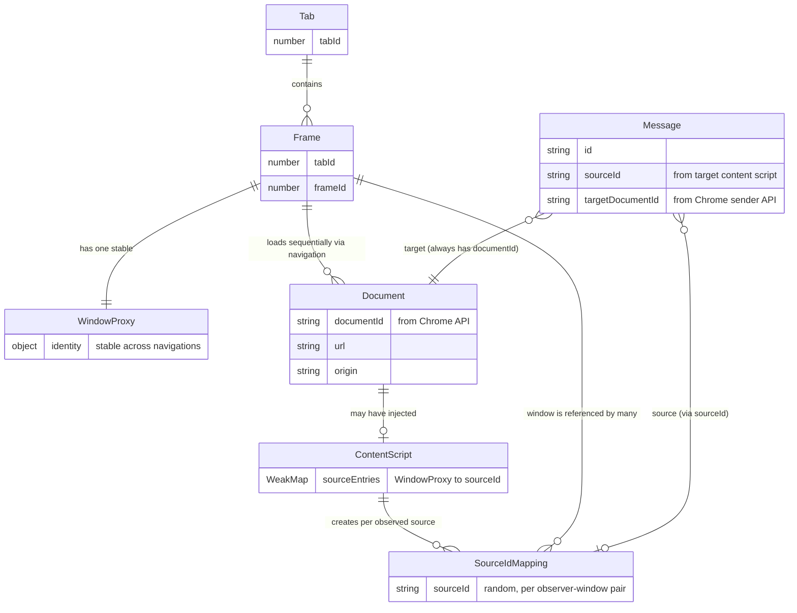

# SourceId Relationships

## Overview

A `sourceId` is a random identifier generated by a content script running in the **target** document. It identifies the source window (WindowProxy) of a message, as observed by that specific target. Understanding how sourceId relates to frames, documents, and windows is critical for correct data modeling in the panel.

## Entity Relationship Diagram

## Key Relationships

### Frame → WindowProxy (1:1, stable)
A frame's WindowProxy persists across navigations. When a child iframe navigates to a new URL (even cross-origin), `iframe.contentWindow` returns the same object. This is per the HTML spec: the WindowProxy is tied to the browsing context, not the document.

Verified by `e2e/window-proxy-identity.spec.ts`.

### Frame → Document (1:many, sequential)
Each navigation within a frame produces a new document with a new `documentId` (assigned by Chrome's webNavigation API). The frame identity stays the same.

### Frame → SourceIdMapping (1:many)
The same frame can have **different sourceIds** depending on which content script is observing it. For example, if frame B is a child of frame A and a parent of frame C:
- Frame A's content script assigns one sourceId to frame B's WindowProxy
- Frame C's content script assigns a different sourceId to frame B's WindowProxy

### SourceIdMapping → Document (no direct link)
A sourceId does **not** identify a document. It identifies a WindowProxy, which persists across document navigations. After a child iframe navigates, the target's WeakMap lookup still returns the same sourceId for the new document's messages.

Registration messages are what bridge `sourceId` → `documentId`, creating an indirect link between the two.

## How SourceIds Are Created

1. A message event fires in the target document
2. The target's content script looks up `event.source` (a WindowProxy) in its local `WeakMap`
3. If not found, generates a new random sourceId and stores the mapping
4. The sourceId is included in the captured message sent to the background script

This means:
- If the **target** navigates, its content script reinitializes with a fresh WeakMap — all sourceId mappings for that target are lost. The same source windows get new sourceIds.
- If the **source** navigates, the WindowProxy stays the same — the target's WeakMap returns the same sourceId. The new document is indistinguishable from the old one via sourceId alone.

## Current Panel Model Mismatch

The panel-side data model currently treats sourceId as a property of `FrameDocument`:
- `FrameDocument.sourceId` — stores a single sourceId on the document
- `FrameStore.documentsBySourceId` — maps sourceId → FrameDocument

This is incorrect in two ways:
1. **sourceId identifies a frame/window, not a document** — multiple documents in the same frame share the same sourceId (from a given observer's perspective)
2. **A frame can have multiple sourceIds** — one per observing content script, not one globally
